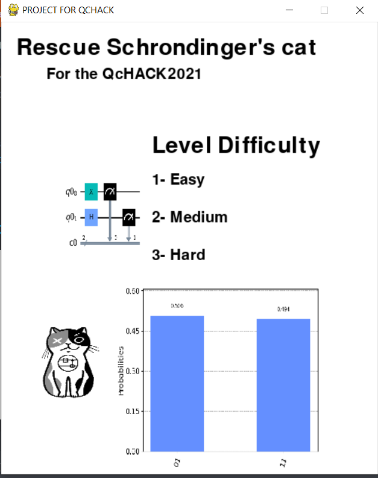
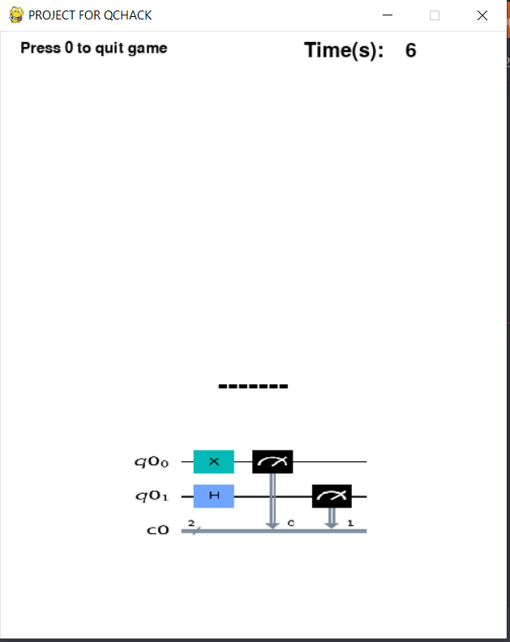
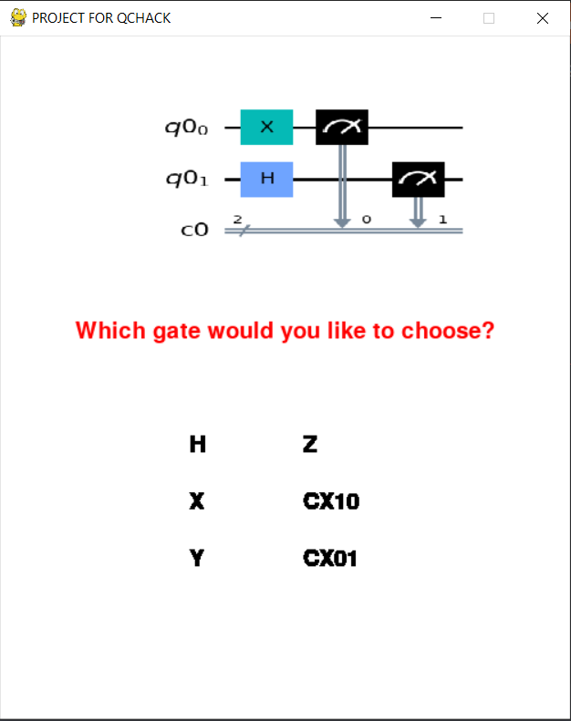
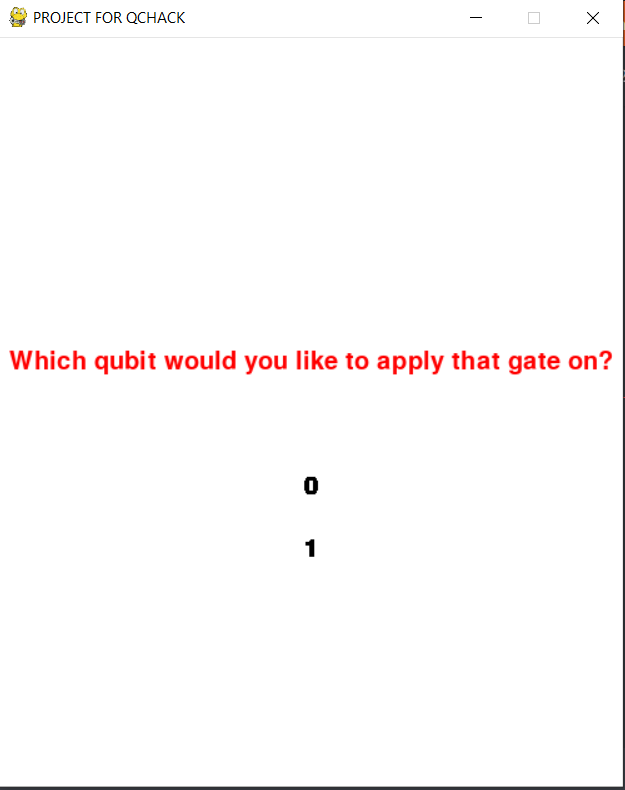

# QCHACK2021

**RESCUE SCHRODINGER’S CAT**

Welcome to the Quantum game of Rescue Schrodinger’s Cat, where you will have a chance to save the cat of world renowned scientist Schrodinger. The probability will be your best friend to save the cat from death. Let us look into the rules of the game,
Rules:-
a)	To play this funny game, you have to choose the difficulty level first. There will be 3 difficulty levels, from easy to hard via medium. Just choose the one you are most confident of.
b)	Now it is very simple, as you only have to guess a letter and fill it in the given blank position.
c)	There can be 2 possibilities after feeding in a letter, which are
1.	The guessed letter is correct, in which case, the letter will stay in the given position. Moreover, you are ahead one step to the cat survive.
2.	Otherwise the guessed letter can be incorrect, in which case, you will apply a quantum circuit with a randomly chosen qubit. Executing this step, the probability will play the role of your best friend here. If the probability of the state 11 is present, then you will have another chance to feed in another letter, while the cat is still alive.
d)	Unfortunately, if the probability of state 11 is present, then we will have to be very afraid of Schrodinger, as his cat is dead.
Saying all of those rule, it is time to play the game directly. We can divide the games into multiple phases, and we will go through the phases one-by-one,
1.	Entry Phase:- In this phase, we will see a screen a like below, which we will provide us three options to choose from. These options will lead us to different difficulty states.
 
 

For simplicity we can choose the option 1, which is Easy. Now we can move onto the next phase.
2.	Letter guessing:- Letter guessing phase will have a screen that will prompt you feed in letter of your choice. So, please input any letter that comes to your mind. We will input the letter ‘e’, which stands for Entanglement. 
 

3.	Quantum Gate Selecting Phase: - As you know from the above section, that if the guessed letter is incorrect, then you have to apply any quantum gate of your choice. The gates, which you can apply is the below ones,
 

4.	Qubit Choosing Phase: - After choosing the quantum gate, please choose the qubit of your choice, which can be either 0 or 1. 

 

If the probability of the state 11 is non zero, then we can have another chance of feeding in the letter.
5.	Next Turn Phase: - You have a next turn now, and try doing the steps from the Letter Guessing Phase again. Save the cat.

Please keep in mind that if the probability of the state 11 is more than 40%, then the cat will die for sure.

